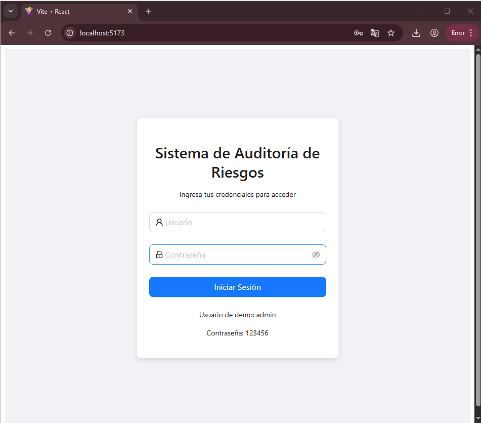
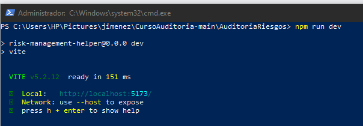
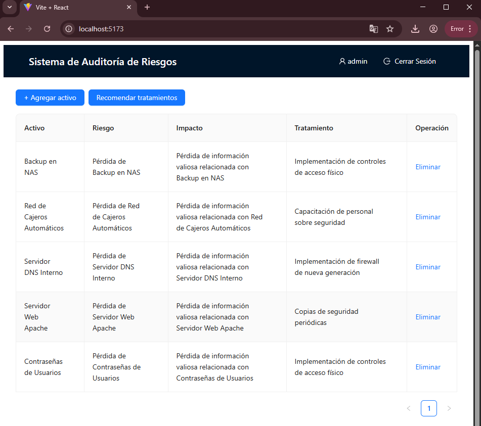

# Informe de Auditoría de Sistemas - Examen de la Unidad I

**Nombres y apellidos:** Carlos Escobar  
**Fecha:** 10/09/2025  
**URL GitHub:** https://github.com/MrPol4r/EXAMU1-Escobar

---

## 1. Proyecto de Auditoría de Riesgos

### Login
**Evidencia:**  
  
**Descripción:** Login ficticio sin BD con usuarios en memoria y sesión.

### Motor de Inteligencia Artificial
**Evidencias:**  
-   <!-- captura del archivo ai.py / ruta equivalente -->
-     <!-- captura del JSON generado -->
**Descripción:** Motor IA local con Ollama (llama3.1:8b). Prompt estructurado que devuelve JSON con amenazas, vulnerabilidades, impacto CIA, probabilidad, controles ISO, recomendación y riesgo.

---

## 2. Hallazgos

### Activo 1: Base de Datos de Clientes
**Evidencia:**   
**Condición:** Sin TDE; backups en misma VLAN.  
**Recomendación:** Habilitar TDE/KMS; segmentar red de backups; mínimo privilegio; monitoreo.  
**Riesgo:** **Alto**.

### Activo 2: API de Transacciones
**Evidencia:**   
**Condición:** Sin rate limiting ni mTLS.  
**Recomendación:** Rate limiting; mTLS; WAF; validaciones.  
**Riesgo:** **Alto**.
---

## Anexo 1: Activos de información
> Los 5 activos fueron tomados de la lista oficial del caso. (Incluye referencia visual a la tabla del caso).
